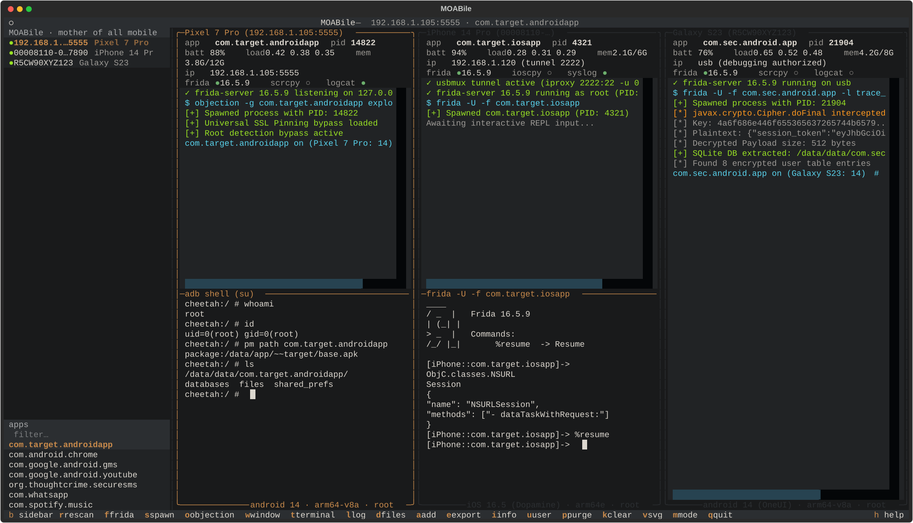
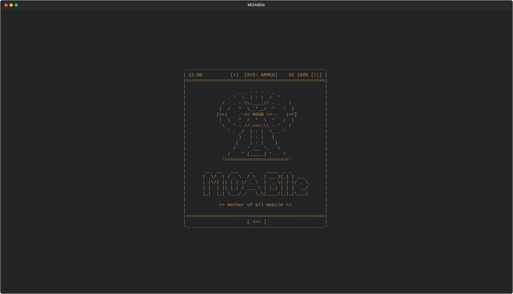
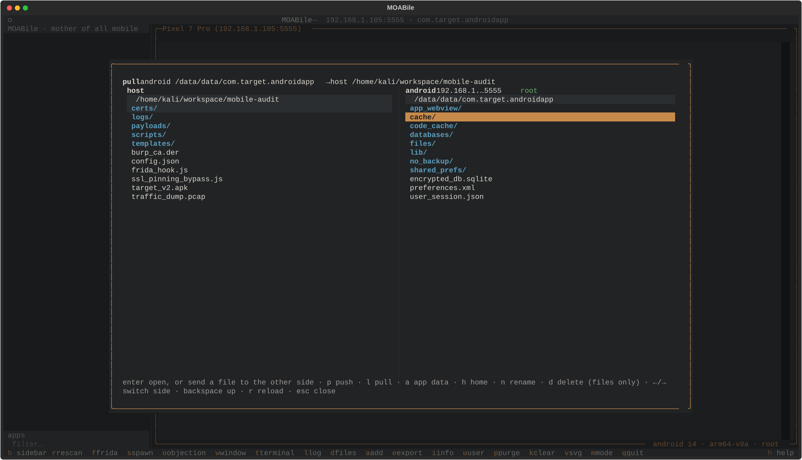

# MOABile — mother of all mobile

[](LICENSE)
[](https://www.python.org/downloads/)
[](#)
[](#)
[](#)

A multi-device terminal UI for mobile app testing.
Android over `adb`, jailbroken iOS over usbmux and ssh, both at the same time,
each attached device in its own panel.



<p align="center">
  
  
</p>

It does not reimplement the toolchain: it drives `adb`, `scrcpy`,
libimobiledevice, `iproxy`, `ioscpy`, `frida`, `objection`, `curl` and `xz`,
which have to be on `PATH` already. The startup screen reports what is missing
and which of the two device families that leaves usable — an Android-only
machine never needs libimobiledevice installed to get past it.

An iPhone is reached with libimobiledevice for everything that needs no
cooperation from the phone (device info, syslog, installing an ipa) and with ssh
down an `iproxy` tunnel for a shell, the filesystem and frida-server. The ssh
password is asked for once and kept in memory. No key is ever installed on the
phone: that would be a file of ours left behind on someone else's device.

Nothing is assumed to be installed on the phone either. Jailbreaks ship
different halves of a userland, so where a tool the panel asks for is not there
it says so once and falls back — the address row reads `usb` for a phone on the
end of a cable with nothing on the network, because that is what there is to
say: usbmux carries no address, and lockdownd hands out the wifi MAC and never
the lease. What the phone *does* have is found, though: every command carries
the `PATH` a non-interactive ssh leaves out — `/usr/sbin`, and everything a
rootless jailbreak keeps under `/var/jb` — inside `sudo` as well as outside it,
so `grep` and `open` are not reported missing on a phone that has them.

## Run

Two runtime dependencies, then run it as a normal script:

```bash
pip install -r requirements.txt
python3 moabile.py
```

On a distribution that manages its own Python (`error: externally-managed-environment`),
put them in a virtualenv first:

```bash
python3 -m venv .venv && . .venv/bin/activate
pip install -r requirements.txt
python3 moabile.py
```

Python 3.10 or newer, and Textual 6.2 or newer — the floor `requirements.txt`
names, and the oldest release the suite passes on. Linux and macOS: it needs a
real pty, so it does not run on Windows outside WSL.

Tested and fully verified on **Kali Linux** (`x86_64`).

No arguments and no options — `--help` says as much as there is to say, and
everything else is a key inside.

## Tools it drives

The startup screen checks for these and reports each one's version. Nothing here
is installed for you — which package manager your machine has, and what it calls
a package, is your business.

| Tool | For | Family | From |
|---|---|---|---|
| `frida` | instrumentation, and its version | both | frida-tools |
| `objection` | exploration REPL | both | |
| `curl` | fetch frida-server and codeshare | both | |
| `xz` | unpack frida-server | both | XZ Utils |
| `adb` | device control | android | android platform-tools |
| `scrcpy` | screen mirroring | android | |
| `idevice_id` | device discovery, info and syslog | ios | libimobiledevice |
| `ideviceinstaller` | ipa install and app list | ios | |
| `iproxy` | ssh tunnel over usb | ios | libusbmuxd |
| `ssh` | shell, filesystem and frida-server | ios | OpenSSH |
| `ioscpy` | screen mirroring | ios | [lautarovculic/ioscpy](https://github.com/lautarovculic/ioscpy) |

Either family works on its own. Both missing, or a core tool missing, and the
gate does not let you through — there would be nothing past it to do.

## Keys

| | | | |
|---|---|---|---|
| `r` | **r**escan for devices | `i` | device **i**nfo dump |
| `b` | the side**b**ar, on and off | `u` | ssh **u**ser for this device |
| `f` | **f**rida-server, on and off | `p` | **p**urge frida-server off the device |
| `s` | **s**pawn the app under frida, or attach | `k` | clear this panel's log |
| `o` | explore the app with **o**bjection | `/` | filter log stream by keyword |
| `w` | mirror the screen in a **w**indow | `c` | **c**opy log / text viewer modal |
| `t` | **t**erminal on the device | `v` | save an s**v**g of the interface |
| `l` | stream the device **l**og | `m` | dark/light **m**ode |
| `d` | files: browse host ↔ device | `h` | **h**elp: keys and widgets |
| `a` | **a**dd an app: install an apk or ipa | `alt+c` | **c**opy terminal session / viewer |
| `e` | **e**xport the app's apk/ipa | `f8` | return focus from tool pane |
| `q`, `ctrl+q` | **q**uit | | |

`s` spawns the app under frida, which is what a script that has to be in
place before the app starts needs. Where the app is already running it offers
to attach to it instead — the app keeps whatever state it is in, and a script
on the running process sees what the device log does not carry: the unified
log's debug and info entries never reach `idevicesyslog`. Enter and escape keep
the spawn. `f` toggles frida-server, offering to match the host client, keep
what is installed, or install a specific custom version.

An app that is off screen is suspended on iOS, and attaching to a suspended
process is a prompt that never arrives — so `s` and `o` bring the app to the
front first, with `open` on the phone. A jailbreak that has no `open` is asked
to do it by hand rather than left looking stuck, and `o` says so at once
instead of watching a process table that is not going to change. Android needs
none of this: a process there runs whether it is on screen or not.

The device log, `l`, is pinned to the app's pid rather than its name: `logcat`
is asked for `--pid`, and on iOS `idevicesyslog` has no pid filter at all — its
`-p` matches process *names*, and a process merely named something similar
comes with it — so the pid is applied here, on the bracket every syslog line
carries after the process name. Which is why the whole-device-or-one-app
question comes up only while the app is running: with no pid there is no
filter to be had, so the stream is the whole device and the panel says why.
`/` filters the active stream in real time by keyword, and `c` opens the
accumulated log in a selectable viewer modal with native clipboard copy.

Inside the file browser (`d`): `p` push host → device, `l` pull device → host, `a`
jumps to the app's own data directory and `h` back to where the device side
opened (`/sdcard` or `/var/mobile`), `n` rename, `d` delete, `←`/`→` switch
side, `backspace` up, `r` reload, `esc` close, and `enter` opens a directory or
transfers the file under the cursor.

Every panel keeps its own selected app and frida arguments, so multiple devices
can be worked in parallel without crossing over. The sidebar highlights the active
device at the top, and lists its installed packages at the bottom.

## Nothing is left behind

Not a design goal that happened to fall out — the point. Nothing is written to
disk between runs: no config, no history, no selected app, no ssh account.
What you were looking at is a record of the work, and this is a tool for leaving
none of that. The single exception is the frida-server download, cached one
version deep where caches go.

While an iOS panel is open, ssh's multiplexing socket lives in the temporary
directory — an empty file holding no data of yours, unlinked when the panel
closes. A crash leaves it there, and the next run clears the one it finds.

## Tests

Headless, driven by fake tools on `PATH`, no device required:

```bash
python3 test_moabile.py
```

It prints a `PASS` line per check and `all good` at the end. Run it as a script,
not under pytest: the module executes the suite on import. One copy at a time —
it opens real local ports for the usb tunnel, so two runs at once collide.

Lint:

```bash
ruff check .
```

## Scope

A testing tool for devices you own or are authorised to test. It talks to
whatever is plugged in over the phone's own debug interfaces — that is the job,
and it is yours to have permission for.

## License

MIT — see [LICENSE](LICENSE).
